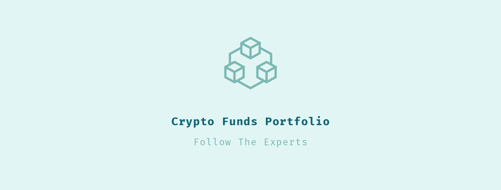
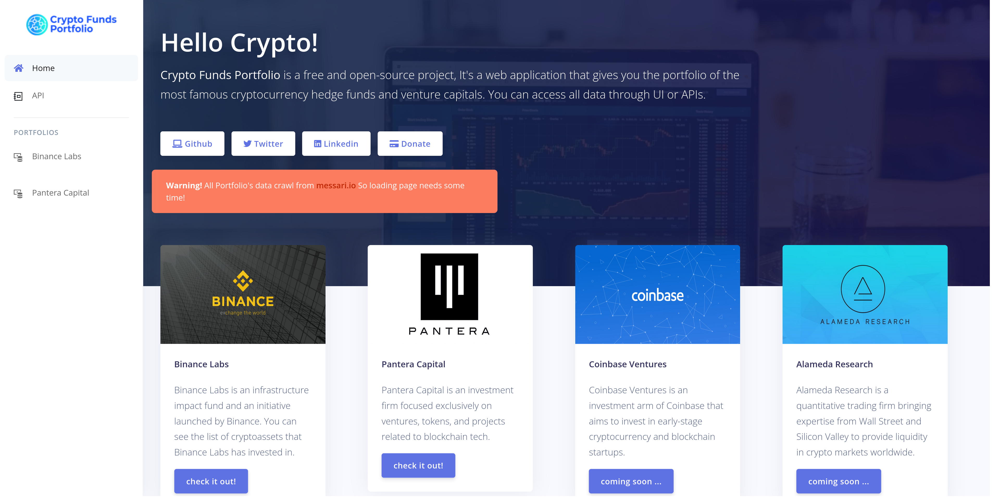
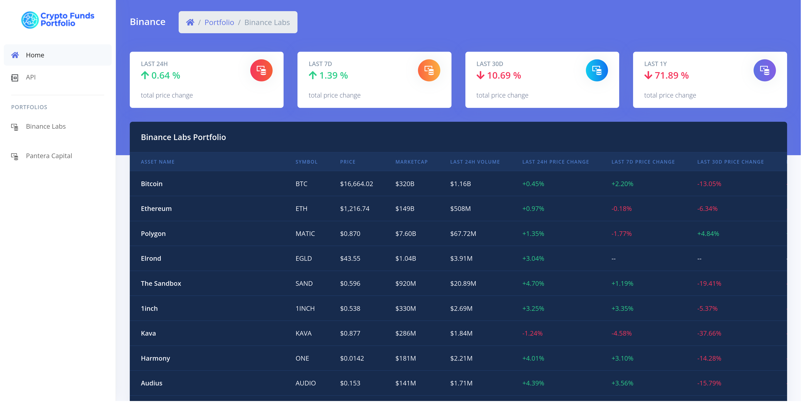
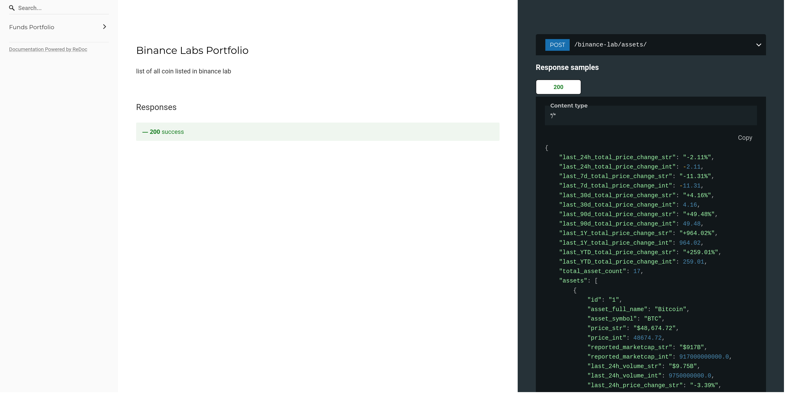

<p align="center">
  <br/>

  
  
  
  
  
  
  
</p>

# Crypto Funds Portfolio
**Crypto Funds Portfolio** is a free and open-source project, created by the _Django framework_. It's a web application that gives you the portfolio of the most famous cryptocurrency hedge funds and venture capitals.
You can access all data through UI or APIs.

> The main content of this app crawled from [messari.io](https://messari.io/)

# Live Demo

You can see the deployed version of project [here](https://crypto-funds-portfolio.herokuapp.com/)

# Requirements

```markdown
- python version 3.8 or upper
- selenium + chrome & chromedriver
```

# Run Locally

First you need to install [google chrome](https://support.google.com/chrome/answer/95346?co=GENIE.Platform%3DDesktop&hl=en). 
After that download [chromedrive](https://chromedriver.chromium.org/downloads) based on your chrome version and put it 
on chromedrive folder in project. now follow these steps :

**Step 1 :** Change `.env.local.sample` to `.env` and if you are in restricted area (means that you can not open messari.io normally)
then run your proxy and set `RESTRICTED_AREA` to `True` and change `PROXY_HOST` and `PROXY_PORT` to your setting,
 otherwise set it to `False`.
```shell
$ mv .env.local.sample .env
```

**Step 2 :** create a new virtualenv and install requirements.
```shell
$ virtualenv -p python3 venv
$ source venv/bin/activate
$ pip install -r requirements.txt
```

**Notice :** if you get psycopg2 `pg_config` error use this command
```shell
$ sudo apt-get install libpq-dev
```

**Step 3 :** run django and reach whole project in [http://localhost:8000/](http://localhost:8000/).
```shell
$ python manage.py runserver
```

# Deploy on Heroku

The project completely compatible with **heroku** and everything is configured.
Just fork the project to your github account and connect your heroku app to repository.
then follow these two steps :

**Step 1 :** add these `buildpacks` to your heroku app

- [google chrome](https://github.com/heroku/heroku-buildpack-google-chrome)
- [chromedrive](https://github.com/heroku/heroku-buildpack-chromedriver)

**Step 2 :** add environments in `.env.heroku.example` to your heroku app `config vars`

```shell
# .env.heroku.example

ON_HEROKU=True
CHROMEDRIVER_PATH=/app/.chromedriver/bin/chromedriver
```

# Swagger API Document

You can see the API document [here](https://crypto-funds-portfolio.herokuapp.com/docs/)

# Screenshots

### Home Page



### Portfolio



### Api



